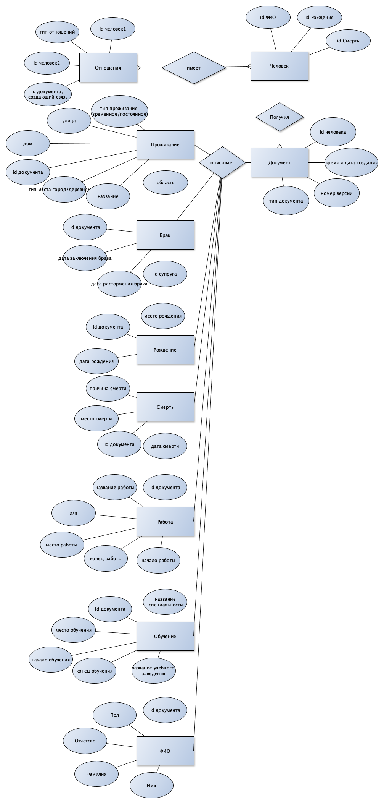

# Цель работы

В настоящее время у каждой государственной структуры 
существует своя база данных, минусом такого решения 
является сложность получения информации по 
определенному человеку, так как необходимо 
делать запрос в каждую государственную структуру. 
Очевидно, что времени, необходимого для получения 
информации из разных хранилищ, будет затрачено 
намного больше, чем времени запроса в одно 
хранилище. Поэтому логичным решением будет 
сформировать универсальное хранилище для всех 
государственных структур, которое легко 
масштабируется.

# Краткий перечень функциональных требований
Программа должна обладать следующей функциональностью:
1. добавление документов в БД;
    1. так как у документов возможны различные типы, необходимо, чтобы в интерфейсе заполняемые поля соответствовали типу документа;
2. получение статистики на основе данных из БД;
    1. импортирование файла с готовыми SQL-запросами с возможностью их использования;
3. администрирование БД;
    1. ввод SQL-запроса;
    2. вывод результата в виде таблицы.

# Use-case диаграмма системы

# ER-диаграмма сущностей системы

